# GitHub Streak Tracker

Welcome to the GitHub Streak Tracker! This tool helps you visualize your GitHub activity streaks and add them to your profile README.
[Documentation](https://gitstreakx.vercel.app/)

## Available Themes

Here are all the available themes along with their previews:

<table border="1" cellpadding="10">
  <tr>
    <td style="text-align: center;">
      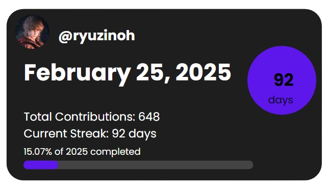
      
<strong>Midnight/Default</strong>

    </td>
    <td style="text-align: center;">
      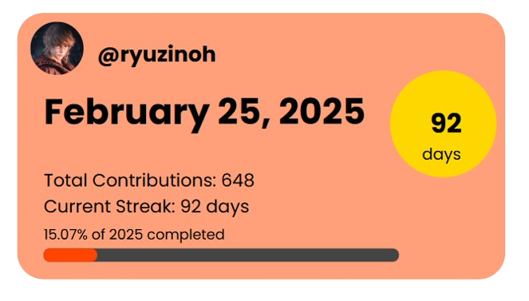
      
<strong>Sunset</strong>

    </td>
    <td style="text-align: center;">
      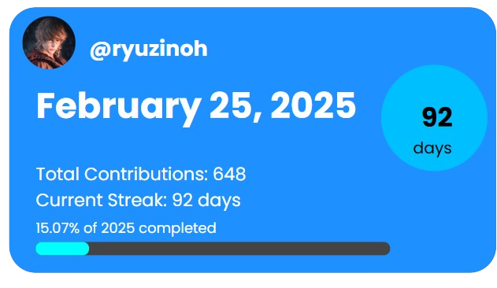
      
<strong>Ocean</strong>

    </td>
  </tr>
  <tr>
    <td style="text-align: center;">
      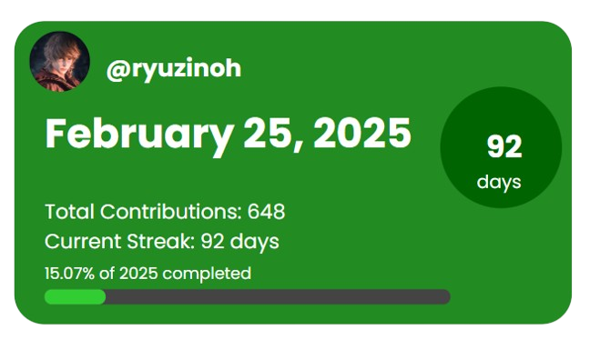
      
<strong>Forest</strong>

    </td>
    <td style="text-align: center;">
      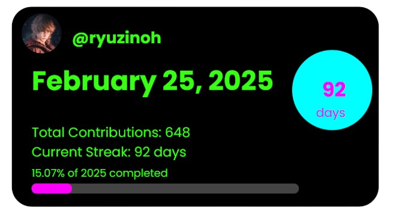
      
<strong>Neon</strong>

    </td>
    <td style="text-align: center;">
      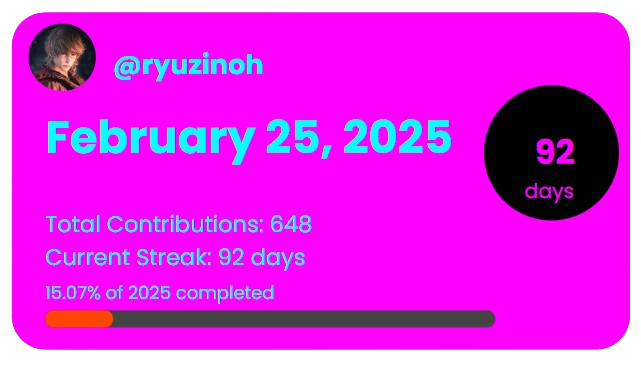
      
<strong>Cyberpunk</strong>

    </td>
  </tr>
  <tr>
    <td style="text-align: center;">
      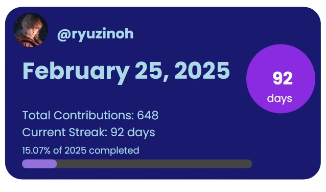
      
<strong>Galaxy</strong>

    </td>
    <td style="text-align: center;">
      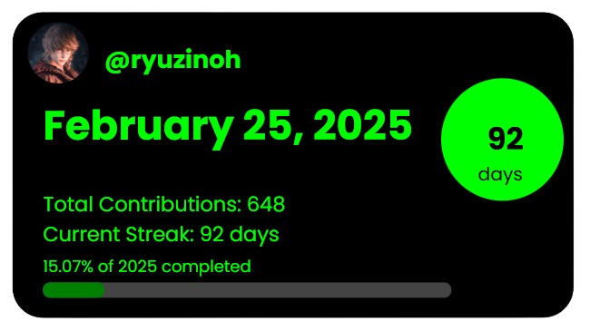
      
<strong>Matrix</strong>

    </td>
    <td style="text-align: center;">
      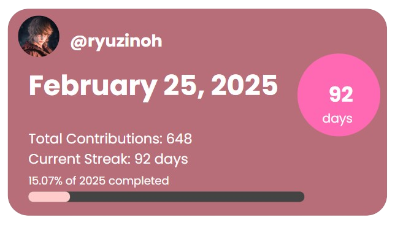
      
<strong>Rose Gold</strong>

    </td>
  </tr>
  <tr>
    <td style="text-align: center;">
      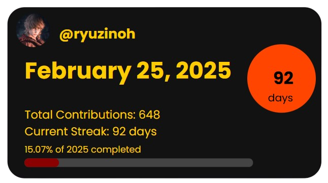
      
<strong>Dark Knight</strong>

    </td>
    <td style="text-align: center;">
      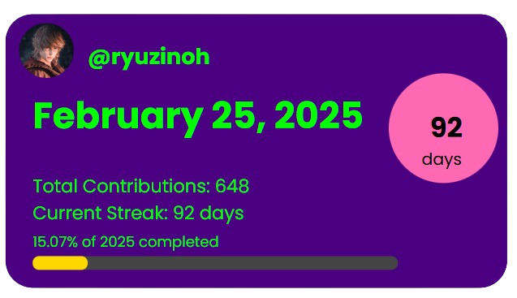
      
<strong>Aurora</strong>

    </td>
    <td style="text-align: center;">
      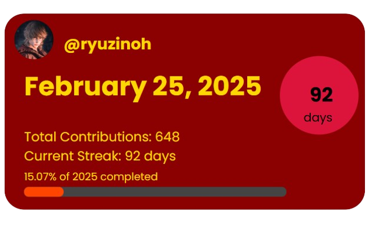
      
<strong>Lava</strong>

    </td>
  </tr>
</table>
